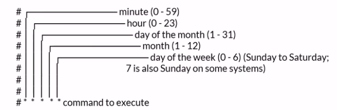

# 🐳 Docker & Kubernetes — Quick Reference Notes

---

## 📄 Dockerfile Structure

A `Dockerfile` defines how to build a container image. Common instructions:

| Instruction | Purpose |
|---|---|
| `FROM [image]` | Base image to build from — **use pinned/static versions** |
| `RUN [command]` | Execute commands during image build |
| `COPY . /src` | Copy local files into the container's filesystem |
| `EXPOSE [port]` | Documents which port the container listens on (metadata) |
| `ENTRYPOINT ["cmd", "arg"]` | Defines the default command to run when container starts |

### Example Dockerfile

```dockerfile
FROM python:3.11-slim
COPY . /src
RUN pip install -r /src/requirements.txt
EXPOSE 8080
ENTRYPOINT ["python", "/src/main.py"]
```

---

## 🔨 Building & Running Images

```bash
# Build an image from a Dockerfile (. = current directory)
docker build -t [image_name]:[tag] [directory]

# Run a container from an image
docker run [image_name]:[tag]
```

---

## 💾 Volumes

Use volumes to persist data or share files between host and container.

```bash
# Create a named volume
docker volume create [volume_name]

# Delete a volume
docker volume rm [volume_name]

# Mount a volume when running a container
docker run -v [volume_name]:/path/in/container [image]
```

---

## 🧩 Docker Compose

Compose lets you define and manage **multi-container** applications in a single `docker-compose.yml` file.

### Basic Structure

```yaml
services:
  app:
    image: my-app:latest
    ports:
      - "8080:8080"
  db:
    image: postgres:15
    ports:
      - "5432:5432"
```

### Common Commands

```bash
docker compose build          # Build images
docker compose up             # Start containers (foreground)
docker compose up -d          # Build + start in background (detached)
docker compose stop           # Stop running containers
docker compose exec [container] bash   # Open a shell in a running container
docker compose cp [src] [container]:[dest]   # Copy files to/from container
docker compose -p [project_name] up -d       # Run as a named project instance
```

### Resource Limits

```yaml
services:
  app:
    deploy:
      resources:
        limits:
          cpus: '0.5'
          memory: 150M
```

### Environment Variables

```yaml
environment:
  - FOO=BAR
  - POSTGRES_VERSION=${POSTGRES_VERSION}   # from .env file
```

### Dependencies Between Containers

Use `depends_on` to control startup order:

```yaml
services:
  app:
    depends_on:
      - db
  db:
    image: postgres:15
```

### Restart Policies

```yaml
restart: no              # Default — never restart
restart: always          # Always restart
restart: on-failure      # Restart only on non-zero exit
restart: unless-stopped  # Always restart unless manually stopped
```

---

## ☸️ Kubernetes

### Contexts

A **context** groups three access parameters: a **cluster**, a **user**, and a **namespace**.

```bash
kubectl config current-context        # Show active context
kubectl config get-contexts           # List all contexts
kubectl config use-context [name]     # Switch to a context
kubectx [context_name]                # Shorthand (requires kubectx tool)
```

### Namespaces

Namespaces are logical folders to group resources (e.g. `dev`, `test`, `prod`).  
Objects across namespaces can still communicate with each other.

```bash
kubectl get ns                                          # List all namespaces
kubectl create ns [namespaceName]                       # Create a namespace
kubectl config set-context --current --namespace=[ns]  # Set default namespace
kubectl get pods --all-namespaces                       # List pods everywhere
```

---

## 🗂️ Kubernetes Architecture

### Master Node

| Component | Role |
|---|---|
| **etcd** | Key-value store — single source of truth for cluster state |
| **kube-controller-manager** | Runs Node, Replication, Endpoints, Token & Service controllers |

### Worker Nodes

Physical or virtual machines that run one or more pods.

| Component | Role |
|---|---|
| **Kubelet** | Manages pod lifecycle; ensures containers match pod specs and stay healthy |
| **Kube-proxy** | Manages network rules for pod communication |

### Pods 

Atomic unit of work in k8s:

- Encapsulates an app container
- Represents a unit of deployment
- Pods can run **n** containers

They do share IP, volumes, an communicate using **localhost**

!! Scale out by adding more pods, not more containers in a pod 

## Pod lifecycle 

1. Send information through the CLI
2. Information written in etcd
3. Scheduler watches for the nodes and where to put the pod, (load balancer?)
4. ALL HAIL etcd!


```bash
kubectl create -f [pod-definition.yaml]          # Create a pod
kubectl run [podname] --image=[imageName]        # Run a pod imperative way
kubectl get pods -o wide          # List pods
kubectl describe pod [podname]           # show pod info
kubectl exec -it [podname] -- sh   # Open a pod in interactive mode 
docker compose cp [src] [container]:[dest]   # Copy files to/from container
docker compose -p [project_name] up -d       # Run as a named project instance
```
## Init containers
A way to make sequential start. If it fails kubelet restarts until it succeeds (Unless the policy is set to Never). First run over the initContainers, then the app containers

```yaml
spec:
  containers:
  initContainers:
    -name:
    image:
    command:
    -name:
    image:
    command:
```

To check logs use the simple command 

```bash
kubectl logs [podname] -c [ContainerName]
```
For quick reference, use different deployments for lightly coupled architectures. If you need it to be tightly coupled, some patterns are Sidecar(like monitoring the output or refresh or update files continously, extend the service capabilities) or an Ambasador (specalized sidecar to manage external communication)

## Networking

In k8s:
- All containers a pod can communicate with each other
- All pods can communicate with each other
- All nodes can communicate with all pods 
- Pods are given ephemeral IPs
- Services are given persistent IP (for critical workloads??)

!! For communication between pods use a service!!  

## Workloads
### ReplicaSets

Primary method to provide self-healing capabilities.Always ensure desired number of pods are running.Though, do not use them!! use Deployments.

We would use a standard pod deployment like...
```yaml
apiVersion: v1
kind: Pod
metadata:
  name: myapp-pod
  labels:
    app: nginx
    type: front-end
spec:
  containers:
    - name:
      image:
      ports:
      - containerPort: 80
```

Then we would paste it into the following format

```yaml
apiVersion: apps/v1
kind: ReplicaSet
metadata:
  name: rs-example
spec:
  replicas : <n_replicas>
  selector:
    matchLabels:
      app: nginx
      env: front-end
  template:
    <pod template>
  ```


```bash
kubectl apply -f [definition.yaml]          # Create a ReplicaSet
kubectl get rs        # List ReplicaSets
kubectl describe rs [rsName]          # Get info
kubectl delete -f [definition.yaml]           # Delete a ReplicaSet
kubectl delete rs [rsName] # delete but with name
```

### Deployments

Manage a single pod template. You can create a pod for each microservice. They are ReplicaSets in the background.

The deployment updates and rollbacks, while the ReplicaSets provide scalability.

There are some important parts of a deployment that ares important like:
- Replicas -> Number of pod instances
- revisionHistoryLimit -> Number of previous iterations to keep
- strategy 
  - RollingUpdate -> Cycle through updating pods
  - Recreate -> All existing pods are killed before new ones are created 

We would use a standard pod deployment like...
```yaml
apiVersion: v1
kind: Pod
metadata:
  name: myapp-pod
  labels:
    app: nginx
    type: front-end
spec:
  containers:
    - name:
      image:
      ports:
      - containerPort: 80
```

Then we would paste it into the following format

```yaml
apiVersion: apps/v1
kind: Deployment
metadata:
  name: rs-example
spec:
  replicas : <n_replicas>
  revisionHistoryLimit: 3
  selector:
    matchLabels:
      app: nginx
      env: front-end
  strategy:
    type: RollingUpdate
    rollingUpdate:
      maxSurge: 1
      maxUnavailable: 1
  template:
    <pod template>
  ```


```bash
kubectl apply -f [definition.yaml]          # Create a ReplicaSet
kubectl get deploy        # List Deployments
kubectl describe deploy [deployName]          # Get info
kubectl delete -f [definition.yaml]           # Delete a ReplicaSet
kubectl delete deploy [rsName] # delete but with name
```

### DaemonSet

Ensures all nodes or subset of nodes run an instance of a pod. This means that as nodes are added to the cluster pods are run into them automatically. 

For example we would do:

```yaml
apiVersion: apps/v1
kind: DaemonSet
metadata:
  name: daemonset-example
spec:
  selector:
    matchlabels:
      app: daemonset-example
  template:
    metadata: 
      labels:
        app: daemonset-example
    spec:
      tolerations:
      - key: node-role.kubernetes.io/master
        effect: NoSchedule
      containers:
      - name: busybox
        image: busybox
        args:
        - "sleep"
        - "100000"
  ```
!!! the tolarations, are like exceptions, in this case is to not put one in the master node 

```bash
kubectl apply -f [definition.yaml]          # Create a ReplicaSet
kubectl get ds        # List DaemonSet
kubectl describe ds [rsName]          # Get info
kubectl delete -f [definition.yaml]           # Delete a DaemonSet
kubectl delete ds [rsName] # delete but with name
```

### StatefulSet

Used for pods that need to mantain state, it mantains a  sticky identity for its pods. This means that the pod name persists

Creates them from 0 to X and deletes them from X to 0

It is important to mentions we need a needless service. For example we would do:


```yaml
apiVersion: apps/v1
kind: Service
metadata:
  name: mysql
spec:
  ports:
  - name: mysql
    port: 3306
  clusterIP: None --> This makes it headless
  selector:
    app: mysql
  ```

The we need to reference the same name via serviceName:


```yaml
apiVersion: apps/v1
kind: StatefulSet
metadata:
  name: mysql
spec:
  serviceName: mysql
  replicas: 5
  selector:
    matchlabels:
      run: nginx-sts-demo
  template:
    metadata: 
      labels:
        run: nginx-sts-demo
    spec:
      containers:
      - name: busybox
        image: busybox
        args:
        - "sleep"
        - "100000"
volumeClaimTemplates:
- metadata:
    name: data
  spec:
    storageClassName: default
    accessModes:
      - ReadWriteOnce
    resources:
      requests:
        storage: 1Gi
  ```
```bash
kubectl apply -f [definition.yaml]          # Create a StatefulSet
kubectl get sts        # List statefulSet
kubectl describe sts [rsName]          # Get info
kubectl delete -f [definition.yaml]           # Delete a StatefulSet
kubectl delete sts [rsName] # delete but with name
```

### Job

Workload for short lived tasks. Creates one or more pods. This is done by creating one pod after another, but we can add parallelism to create them at the same time 


```yaml
apiVersion: batch/v1
kind: Job
metadata:
  name: pi
spec:
  activateDeadlineSeconds: 30
  parallelism: 3
  completions: 3
  template:
    spec:
      containers:
      - name: pi
        image: perl
        command: ["perl", "-Mbignum=bpi" , "-wle", "print bpi(2000)"]
      restartPolicy: Never
  ```

```bash
kubectl create job [jobName] --image=busybox
kubectl apply -f [definition.yaml]          # Create a Job
kubectl get job        # List job
kubectl describe job [rsName]          # Get info
kubectl delete -f [definition.yaml]           # Delete a job
kubectl delete job [rsName] # delete but with name
```

#### CronJob

It is an extension of the Job, executing them in a cron-like fashion using UTC



```yaml
apiVersion: batch/v1
kind: CronJob
metadata:
  name: hello-cron
spec:
  schedule: "* * * * *"
  jobTemplate:
    spec:
      template:
        spec:
          containers:
          - name: busybox
            image: busybox
            command: ["echo", "Hello from the Job"]
          restartPolicy: Never
  ```

  
```bash
kubectl create cronjob [jobName] --image=busybox --schedule="*/1 * * * *" -- bin/sh -c "date;"
kubectl apply -f [definition.yaml]          # Create a CronJob
kubectl get cj        # List Cronjob
kubectl describe cj [rsName]          # Get info
kubectl delete -f [definition.yaml]           # Delete a CronJob
kubectl delete cj [rsName] # delete but with name
```

## Updates 

In deployments, you can create some strategies to provide scalability and update your pods
- Replicas -> Number of pods to have up & running at all time
- revisionHistoryLimit -> Number of previous iterations to keep
- Strategy
  - RollingUpdate -> Cycle through updating pods
  - Recreate -> All existing pods are killed before the new ones get created

### Rolling Updates

We can set the maxSurge parameter, which provides the Maximum number of Pods that can be created over the desired number of pods

On the other side, maxUnavailable provides the max number of pods that can be unavailable during the update process

The commands change a little bit
```bash
kubectl apply -f [definition.yaml]          # Update a deployment
kubectl rollout status        # Get update progress
kubectl rollout history deployment [rsName]          # get the history of the deployment
kubectl rollout undo [deploymentname]           # Delete a job
kubectl rollout undo [deploymentname] --to-revision=[revision#]           # Delete a job
```

### Blue-Green Deployments

Lets suppose that on a rolling update we have breaking changes, which can introduce problems. In blue green production, we have the blue which is in productions and green of what is deployed but not yet in production. When we want to roll out the changes, we update the service to point to the new pod or version.

Nevertheless, we need to over provision the cluster size to make it possible